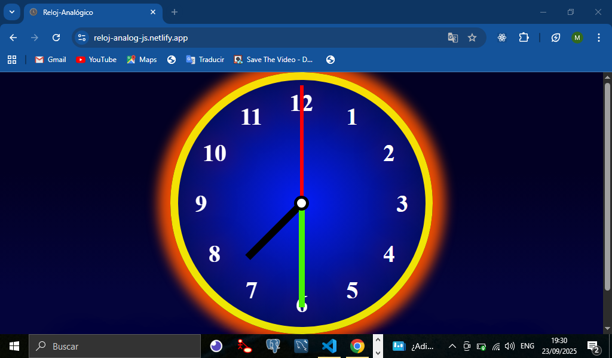
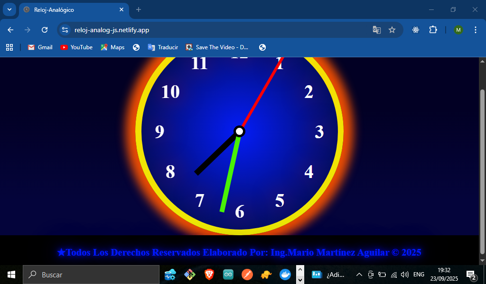
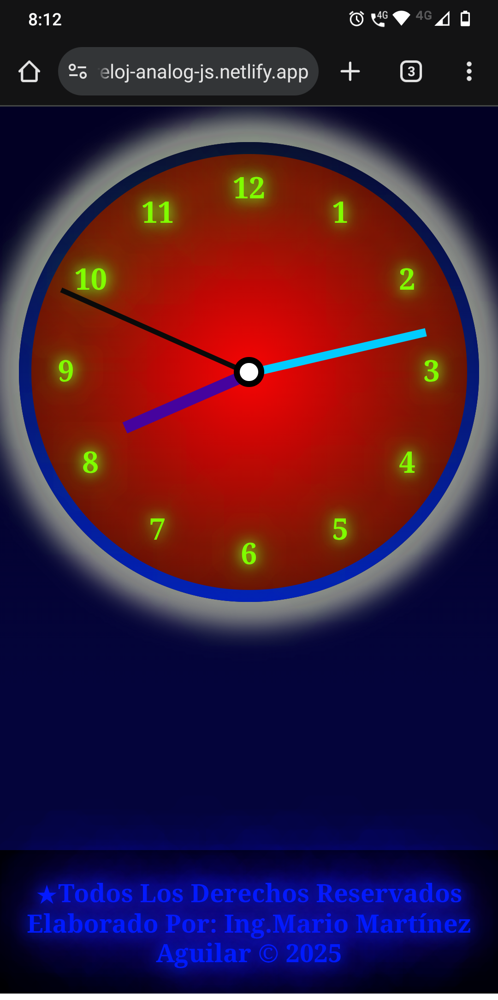
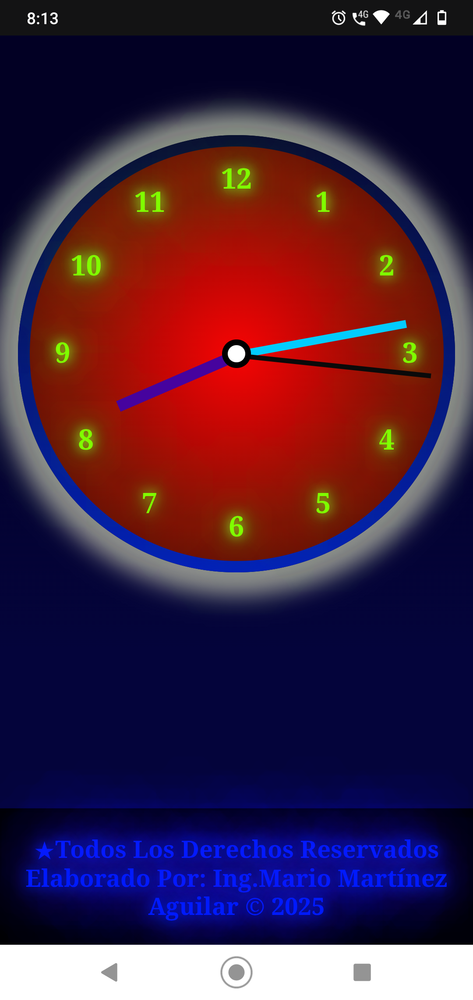
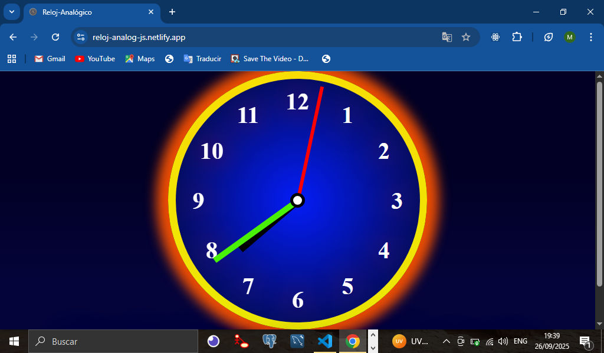
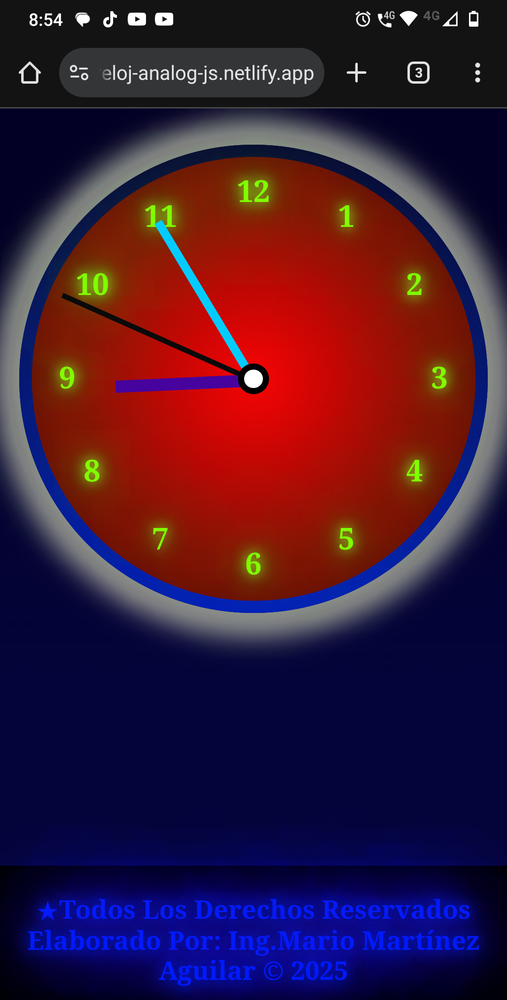

# TITULO DE LA PRÁCTICA WEB   

**ELABORACION DE UN RELOG ANALOGICO CON JAVASCRIPT**

# DESCRIPCIÓN DE LA PRACTICA (Reloj De Manecillas)
**En esta práctica realizamos un reloj tipo analógico con JavaScript, es una práctica orientada al desarrollo web, lo hicimos aplicando conocimientos para su estructura el lenguaje de marcado HTML, para  darle funcionalidad utilizamos el lenguaje de programación JavaScript como para extraer la hora y mostrarla en el reloj de la aplicación web y por ultimo para un diseño único y especial usamos el lenguaje de estilos CSS, como se puede ver la finalidad de esta práctica es repasar los tres pilares fundamentales del desarrollo web y lo hicimos con esta práctica para poder ser capaces de crear y dibujar un reloj de manecillas atractivo y por supuesto funcional con JavaScript, además responsivo para dispositivos móviles utilizando propiedades de CSS así como para utilizar otras propiedades poquito más avanzadas de CSS para darle un diseño a mi gusto y único como colores, manejo de sombras, gradientes y poder tener dos diseños diferentes uno para móviles y el otro normal versión de escritorio. A continuación la explicación más detallada de como estructuramos el reloj (HTML), como le dimos un diseño y estilos (CSS) y la funcionalidad con programación web (JavaScript)**

## VISTA PREVIA DE NUESTRA PRACTICA RELOJ ANALOGICO EN DISENO DE ESCRITORIO



## VISTA PREVIA DE NUESTRA PRACTICA RELOJ ANALOGICO EN DISENO PARA MOVILES



## ESTRUCTURA WEB HTML DEL RELOJ ANALOGICO CON JAVASCRIPT
**En esta parte analizaremos como creamos la estructura de la página web de nuestro reloj analógico con el código HTML como podemos darnos cuenta en nuestro index.html tenemos una etiqueta html `section` que contiene todo el contenido del reloj básicamente esta a su vez contiene una clase llama `clock-container`, para darle estilos que analizaremos más adelante, dentro de la etiqueta section tenemos un `div` con su clase `clock` y es div contiene dentro la estructura de unas etiquetas de párrafo(`p`) con una clase que llame `digit` esto quiere decir que los párrafos que son 12 contiene los 12 digitos de nuestro reloj como podemos ver a continuación en el ejemplo con los primeros 6 dígitos puedes corroborar el código completo en nuestro archivo index.html de este repositorio de git-hub:**
```HTML
    <!--ESTRUCTURA WEB DEL RELOJ-->
    <section class="clock-container">
        <div class="clock">
            <p class="digit" style="--n: 1"><b>1</b></p>
            <p class="digit" style="--n: 2"><b>2</b></p>
            <p class="digit" style="--n: 3"><b>3</b></p>
            <p class="digit" style="--n: 4"><b>4</b></p>
            <p class="digit" style="--n: 5"><b>5</b></p>
            <p class="digit" style="--n: 6"><b>6</b></p>
        </div>    
    </section>    
```

## CREACION DE UNA VARIABLE PERSONALIZADA EN CSS(--n)
**La variable personaliza en CSS que llamamos n, como podemos darnos cuenta en el HTML aparte de la clase tenemos un atributo llamado `style` el contiene una sintaxis especial un poquito avanzada de CSS de la siguiente manera(`--n: 1`), esta sintaxis se repite en cada elemento de párrafo hasta el numero 12 aquí estamos diciendo que estamos creando una variable personalizada en CSS que llamamos `n` y su valor vale `1` hasta que `n` vale `12`, que le vamos a dar funcionalidad y estilos con CSS que explicare más adelante por hora solo creamos la variable como puedes ver en la siguiente línea de código HTML que está en index.html de la estructura del reloj**

```HTML
    <p class="digit" style="--n: 1"><b>1</b></p>
    <!--hasta que n vale12-->                                  
    <p class="digit" style="--n: 2"><b>12</b></p>
```
## ESTRUCTURA WEB HTML DE LAS MANECILLAS DEL  RELOJ
**Por ultimo en la parte de la estructura HTML tenemos tres contenedores `div` cada uno con sus respectivas clases que hacen referencia a las horas, minutos ,segundos y por al último una clase que dice `center` este contenedor div es para poder dibujar un punto central en la circunferencia del reloj de donde se desplazan todas las manecillas esto lo haremos con CSS**
```HTML
    <!--MANECILLAS DE HORAS, MINUTOS, SEGUNDOS Y PUNTO CENTRAL-->
    <div class="hours"></div>
        <div class="minutes"></div>
        <div class="seconds"></div>
        <div class="center"></div>
```
## ESTILIZADO WEB CSS APLICADO EN TODOS LOS ELEMENTOS DE LA PÁGINA
**Empezamos a darle estilos generales a todos los elementos de la página esto lo hacemos con un `*` para referirnos que a todo se aplicaran los siguientes estilos este caso quitamos lo que el margen y el padding de los elementos y agregamos la propiedad `box-sizing` para poder manejar más fácilmente los tamaños como ancho o altos de los elementos de la página como se muestra en el siguiente código CSS, puedes encontrar todos los estilos completos en el archivo styles.css de este repositorio.**
```CSS
    * {
        margin: 0;
        padding: 0;
        box-sizing: border-box;
    }
```
## ESTILOS CSS PARA PODER COLOCAR EL RELOJ EN EL CENTRO DE LA PAGINA WEB
**En esta sección explicaremos los estilos que se le aplico a la clase antes mencionada `clock-container` que es contenedor principal donde se encuentra dentro el contenedor del reloj para poder centrarlo usamos `display flex` y le decimos que todos sus elementos que se encuentren dentro estén centrados con la propiedad `center`,como se puede observar a continuación, cabe señalar que solo se explicaran conceptos que considero importantes en la práctica ya que lo demás son conceptos básicos de CSS al igual con JavaScript, solo es una explicación detallada de la práctica puedes consultar todo el código analizarlo en el repositorio de mi perfil de git-hub**
```CSS
    .clock-container {
        display: flex;
        justify-content: center;
        align-items: center;
        height: 100vh;
    }
```
## CREACION Y DISENO DEL PRIMER CIRCULO QUE CONTIENE LOS NUMEROS DEL RELOJ CON CSS
**Para dibujar el circulo como podemos darnos cuenta tenemos una clase llamada `clock` que es div que dentro contiene los párrafos que contienen los números, entonces aplicamos estilos primero a la clase `clock` estableciendo un tamaño al contenedor, que sus elementos se centren que sea haga un circulo aplicando un `border-radius: 50%`, además le pusimos un `radial-gradient` circular que es un `background` que se compone de dos colores un azul y un negro a continuación el código con las propiedades mencionadas para nuestro primer círculo**
```CSS
    .clock{
        width: 414px;
        height: 414px;
        font-size: 2.5em;
        position: relative;
        border-radius: 50%;
        display: flex;
        justify-content: center;
        align-items: center;
        background-image: radial-gradient(circle,rgb(4, 28, 247), rgb(2, 8, 41))
    }
```

## DISTRIBUCION DE LOS DIGITOS EN EL RELOJ EN TODA LA CIRCUNFERENCIA HACIENDO USO DE LA VARIABLE PERSONALIZADA CSS
**En esta sección ya empezaremos a distribuir los números en toda la circunferencia del reloj vamos hacer uso de la variable personalizada de CSS que creamos la llamamos `n` primero aplicaremos estilos en la clase `digit` con la propiedad `trasform: rotate` rotaremos los digitos dentro del rotate haremos un cálculo con esa variable utilizando la palabra reservada `calc` multiplicaremos el valor de la variable n * 30deg esto significa que como tenemos 12 digitos en un reloj y una circunferencia tiene 360 grados toca multiplicarlos por 30 para que queden exactamente posicionados en todo el circulo ya con la ayuda de una posición absoluta, un top y bottom se distribuirán perfectamente también le dimos un color y una pequeña sombra a continuación el código CSS aplicando la propiedad `tranform:rotate(calc) y el cálculo elaborado`**
```CSS
    /*DISTRIBUCION DE DIGITOS EN EL RELOJ*/
    .digit{
        transform: rotate(calc(30deg * var(--n)));
        position: absolute;
        top: 15px;
        bottom: 15px;
        color:white;
        text-shadow: 0 0 50px rgb(233, 7, 7);
        font-weight: bolder;
    }
```
## SOLUCION DE LOS NUMEROS VOLTEADOS EN EL RELOJ CON CSS

**Si te das cuenta a la hora de aplicar los estilos anteriores tenemos un pequeño problema que es que los números quedan volteados o al revés se miran, tenemos que hacer que se vean como se ven en los de un reloj real para que el diseño se vea bien para esto lo vamos a solucionar de la siguiente manera: primero en HTML tenemos una etiqueta `b` que sirve para poner esos en números en negrita pero no es la verdadera función de esa etiqueta ya que nosotros establecimos un color para esos números entonces a la clase `digit con el elemento b` le aplicaremos de nuevo otro calculo pero esta vez va hacer inverso para que los números se generen al contrario y se solucione ese problema ya después con la ayuda de la propiedad `display: inline-block` se acomodaran perfectamente ya en el reloj y se verán ya bien dichos digitos esto es como dato curioso ya que el reloj de la otra manera se ve un poco raro y es para mejorar el diseño CSS. A continuación el código con el nuevo cálculo a la clase `digit` con su elemento `b`**
```CSS
    .digit b{
            transform: rotate(calc(-30deg * var(--n)));
            display: inline-block;
    }
```

## DISENO CSS DEL SEGUNDO CÍRCULO EN NUESTRA PRÁCTICA DEL RELOJ
**Para esta parte creamos un segundo circulo igual circulas le dimos un tamaño, una posición, un color, así mismo una sombra esto es lo hice para darle un poquito de diseño aplicando otro gradiente con colores llamativos sombras que combinen y resalten, pero utilizamos algo de CSS especial que es `z-index` esto se refiere a que colocamos el elemento atrás del circulo principal del reloj esto para que se vea más bien en cuanto a diseño y conocer más propiedades con las que cuenta CSS, por otra parte usamos algo moderno en CSS que es un pseudoelemento `::before` con esto se aplicamos a la clase clock lo que hará es crearnos un hijo para algún elemento insertado el contenido antes de su contenido principal sin alterar el html es decir en otras palabras sin afectar el contenido del primer círculo que también tiene la clase clock y ya la ayuda del `z-index:-1` lo hacemos que se valla a la parte de atrás, enseguida el código CSS de como usamos el pseudoelemento before en la clase `clock`**
```CSS
    .clock::before{
        content: "";
        width: 439px;
        height:439px;
        position:absolute;
        border-radius:50%;
        /*border:50px solid black;*/
        background-image: linear-gradient(rgb(248, 224, 5), rgb(236, 233, 5));
        /*Aplicamos una sombra al reloj*/
        box-shadow: 0 0 20px 20px rgb(235, 77, 4);
        z-index: -1;
    }
```

## ESTILIZADO WEB CSS PARA CREAR LAS MANECILLAS DEL RELOJ(HORAS, MINUTOS, SEGUNDOS Y PUNTO CENTRAL)
**En esta sección analizaremos como creamos las manecillas del reloj así como el punto central de donde parten primero en la clase `center` le dimos una posición absoluta, un ancho un alto, un fondo, le establecimos un `border` solido de color negro y le dimos un `border-radius:50%` para que se haga un círculo pequeño simulando un punto central de donde salen las manecillas, después a nuestra `hours` le establecimos un tamaño en pixeles un fondo de color para simular las manecillas así mismo para clase `minutes` y la clase `seconds` la diferencial aparte del color que tienen las manecillas es su tamaño y su grosor estableciendo medidas diferentes para cada manecilla lo más parecido a los relojes de verdad como se puede observar en la imagen del principio donde se muestra la práctica ya terminada, a continuación el código CSS del diseño de las manecillas y el punto central.**
```CSS
    .center{
        position: absolute;
        width: 25px;
        height: 25px;
        background-color:white;
        border-radius: 50%;
        border:5px solid black;
    }

    /*creamos la manecilla de las horas*/
    .hours{
        width: 12px;
        height:128px;
        background-color:black;

    }
    /*creamos la manecilla de los minutos*/
    .minutes{
        width:10px;
        height:174px;
        background-color:rgb(73, 241, 6);
    }
    /*creamos la manecilla de los segundos*/
    .seconds{
        width:6px;
        height:198px;
        background-color:red;
    }

```
## CREACION DE LA VARIABLE rotate EN CSS PARA PODER MANIPULARLA CON JAVASCRIPT Y ESTABLECIENDO LOGICA EN CSS DE LAS MANECILLAS DE UN RELOJ
**Hay que tener en cuenta primero cierta lógica de código en la función de un reloj es decir que todas las manecillas parten del centro se desplazan sobre la circunferencia y todas giran hacia un sentido imaginando eso podemos establecer cierto código CSS en las clases: `hours`,`minutes`, `secondos`, teniendo en cuenta eso vamos aplicar estilos CSS a esas tres clases primero crearemos la variable `rotate` y la igualaremos en cero para que empiece en cero, seguido de ahí le damos una posición absoluta para moverlo así al centro y con la propiedad `bottom:50%` van a empezar las manecillas a estar en el centro del círculo, después vamos a aplicar una trasformación a la variable `rotate` para que se mueva estableciendo un cálculo como puedes darte cuenta la manecilla de un reloj de los segundos se mueve cada segundo entonces esa variable `rotate` la multiplicaremos por un `1degradiente` y así ira rotando alrededor de la circunferencia que lo vamos hacer funcionar con JavaScript que se explicara más adelante, ya por ultimo le decimos que la trasformación tenga origen en el centro esto con la propiedad de CSS `transform-bottom` con esto las manecillas empezaran a rotar desde el punto central, enseguida se muestra el código de la lógica de todas las manecillas**
```CSS
    /*lógica común de las manecillas todas giran*/
    .hours,
    .minutes,
    .seconds{
        /*creamos la variable rotate*/
        --rotate: 0;
        position:absolute;
        bottom: 50%;
        transform: rotate(calc(var(--rotate) * 1deg));
        /*aquí le decimos que empiece a rotar desde el punto*/
        transform-origin: bottom;
    }
```
## OTRA VISTA DE NUESTRA PRACTICA VERSION DE ESCRITORIO YA TERMINADA Y FUNCIONANDO


## USO DE MEDIA QUERIES PARA ADAPTAR EL CONTENIDO UN DISPOSITIVO SMARTPHONE(DISPOSITIVO MOVIL)
**Como introducción a los media queries en CSS lo aplicamos en esta práctica adaptamos el contenido a un dispositivo movil estableciendo una regla de medida del ancho máximo de la pantalla solo cambiamos el diseño es decir el tamaño de los círculos(el reloj en general ), por otro lado los colores del gradiente, las sombras y por supuesto el tamaño de las manecillas es algo  bastante sencillo pero nos sirve como introducción a los media queries establecimos algunos cambios en tano de pixeles cuando la pantalla llegue como ancho máximo de 700px podemos cambiar el valor y adaptarlo a cada necesidad que tengamos y así mismo podemos cambiar los estilos que queramos. A continuación el código de como aplicamos el media query en nuestra práctica:**
```CSS
    /*REGLA DE LOS MEDIA QUERIES EN CSS*/
    @media(max-width: 700px){
        /*cambio de tamaño en las manecillas de las horas*/
        hours{
            height: 112px;
            width: 10px;
            background-color: rgb(70, 3, 158);
        }
        /*el código completo en nuestro archivo styles.css de nuestro repositorio*/

        /*código del diseño CSS del círculo del reloj que se cambió para el dispositivo movil puedes checar el otro código donde se aplicó el before en nuestro archivo del repositorio*/
        .clock{
            height: 360px;
            width: 360px;
            font-size: 1.5em;
            font-weight: bold;
            background-image: radial-gradient(circle,rgb(247, 4, 4), rgb(51, 14, 3));
            border-radius: 50%
        }
        
       /*cambio de los digitos colores y sombras*/
        .digit b{
            color: chartreuse;
            text-shadow: 0 0 10px greenyellow,
                 0 0 20px rgb(2, 253, 2),
                 0 0 40px rgb(3, 235, 3),
                 0 0 80px rgb(134, 248, 19),
                 0 0 160px chartreuse,
                 0 0 320px chartreuse;
        }
    }
        
```
## VISTA FINAL DEL RELOJ EN UN DISPOSITIVO SMARTPHONE


## FUNCIONALIDAD WEB CON JAVASCRIPT ELEMENTOS HTML,CLASES,VARIABLES Y QUERYSELECTOR
**En esta parte vamos a empezar a darle funcionalidad al reloj para que ya funcione comenzando a declarar 3 variables `secondHand`,`minuteHand` y `hourHand` estas variables hacen referencia a las 3 manecillas del reloj y las vamos a relacionar con los elementos HTML a través de su clase para eso utilizaremos una propiedad de JavaScript llamada `querySelector` para poder seleccionar el elemento HTML que queremos a continuación la declaración de la variable `secondHand` solo coloque una puedes ver el código completo en el archivo script.js de mi repositorio donde está todo el código JavaScript completo para hacer funcionar el reloj**
```JavaScript
    const secondHand = document.querySelector('.seconds');
```
## EXTRAER LA HORA CON JAVASCRIPT HACIENDO USO DEL OBJETO INTEGRADO DATE
**Para poder extraer la hora exacta con el objeto date primero lo que vamos hacer es crear una función que llamaremos `moverManecillas` no recibe ningún parámetro creamos una variable llamada `date`para poder instanciar el objeto `Date`, ahora vamos a crear tres variables constantes para los segundos, minutos y horas para los segundos vamos hacer la siguiente operación  a nuestra variable `date` con el método `getSeconds` vamos a extraer los segundos de la hora actual y lo dividiremos entre 60, para minutos igual usamos el método `getMinutes` pero tenemos que sumarle los segundos acumulados y luego dividirlos entre 60 también para que las manecillas se muevan lentamente y finalmente para las hora hacemos uso del método `getHours` para la hora actual también le sumamos los minutos y como estas son horas solamente los dividimos entre 12, a continuación el fragmento de código de la función de lo explicado anteriormente:**
```JavaScript
    // creamos una función para mover las manecillas según la hora
    const moveHands = () => {
        //traemos la hora completa con JS
        const date = new Date();
        //traemos los segundos y lo dividimos entre 60 para que gire alrededor del circulo(aplica con minutos), con horas también pero se divide entre 12, después le vamos a sumar los segundos a los minutos y los minutos a las horas para que se vaya dando la hora
        const seconds = date.getSeconds() / 60;
        const minutes = (seconds + date.getMinutes()) / 60;
        const hours = (minutes + date.getHours()) / 12;
    }
```
## MANIPULACION DE LA VARIABLE --rotate PARA DARLE FUNCIONALIDAD AL RELOJ Y LAS MANECILLAS GIREN
**En esta parte de la función vamos a tener que cambiar el valor de la variable `--rotate` el cual la creamos con CSS ya anteriormente explicado. Hay que setearle a la variable  el nuevo estilo ya que esa variable aplica una trasformación con CSS, entonces con JavaScript con la propiedad `style.setproperty` vamos a setear el valor tanto de los segundos, minutos y hora de la hora actual obtenida anteriormente seguido de eso multiplicaremos esos valores por 360 para que puedan ir girando mientras la variable `--rotate` va cambiando su valor  al rededor del circulo como se puede apreciar en el siguiente código de la función:**
```JavaScript
    // vamos a cambiar el estilo la variable(rotate) para que las manecillas se muevan en círculo según la hora actual seteandole el valor a las variables creadas al principio con el querySelector  teniendo el valor actual lo multiplicamos por 360 para que giren en el circulo
    secondHand.style.setProperty('--rotate', seconds * 360);
    minuteHand.style.setProperty('--rotate', minutes * 360);
    hourHand.style.setProperty('--rotate', hours * 360);
```

## LLAMADA DE LA FUNCION CREADA PARA QUE SE PUEDE EJECUTAR CADA SEGUNDO PARA QUE EL RELOJ FUNCIONE CORRECTAMENTE
**Para finalizar la práctica hay que llamar a la función creada que llamamos `moveHands`, como sabemos un reloj de manecillas funciona moviendo cada segundo la manecilla de los segundos entonces tenemos que ejecutar esa función cada segundo para darle la correcta función al reloj esto lo vamos hacer posible con la función de JavaScript que se llama `setInterval` esta función nos va permitir ejecutar cierta función o código cada cierto intervalo de tiempo, su uso requiere de dos parámetros la función a ejecutar en este caso será el nombre de la función que creamos anteriormente `moveHands` y el otro parámetro es el tiempo que lo establecemos en milisegundos es decir cada que queremos que se ejecute esa función en este caso le diremos que se ejecute cada segundo `1000 milisegundos` y así el reloj funcionara en tiempo real a continuación el código JavaScript de cómo se utiliza la función setInterval**
```JavaScript
    // aquí tenemos que llamar la función cada segundo para que el reloj funcione infinitamente con setInterval
    setInterval(moveHands, 1000);
```

### Lista De Tecnologías, Propiedades De JavaScript Y Herramientas Usadas En Nuestra Practica(Reloj De Manecillas Con JS)  

1. HTML(Estructura De Una Pagina Web)
2. Estilizado Web Con CSS
3. JavaScript(Lenguaje De Programación)
4. Visual Studio Code(Editor De Código) 
5. Manejo De Archivos Js En el Documento HTML
6. Manejo De Script JavaScript Con Atributo(defer)
7. Función JavaScript(setInterval) 
8. Hacer Referencia A Elementos HTML(document.querySelector)
9. Creación De Variables En CSS(--n, --rotate) 
10. CSS Anidado (Selectores De Clase)
11. Manejo De Sombras En CSS(text-shadow)
12. Objeto Date De JS(Fechas)
13. Método getHours(Horas)
14. Método getMinutes(Minutos)
15. Método getSeconds(Segundos)
16. Pseudoelemento En CSS(before)
17. Uso De Media Queries En CSS
18. Manejo De Fondos Circulares En CSS(radial-gradient)
19. Display Flex En CSS
20. Transformaciones En CSS(transform)
21. Realización De Cálculos Con Variables En CSS(cal)
22. Manejo De Tamaños, Posiciones, Bordes Y Colores En CSS
23. Implementación De z-Index En CSS
24. Arrow Function En JavaScript
25. Cambiar Estilos De Una Variable CSS JavaScript(style.setProperty)
26. Git-Hub
27. Publicación De La Página en (Netlify)

### *Elaborado Por: Mario Martínez Aguilar*


        


            
        
